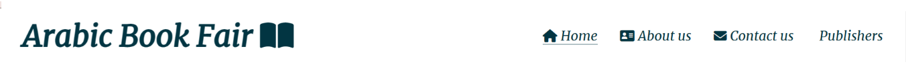
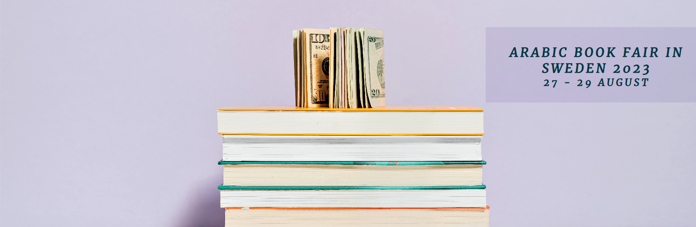
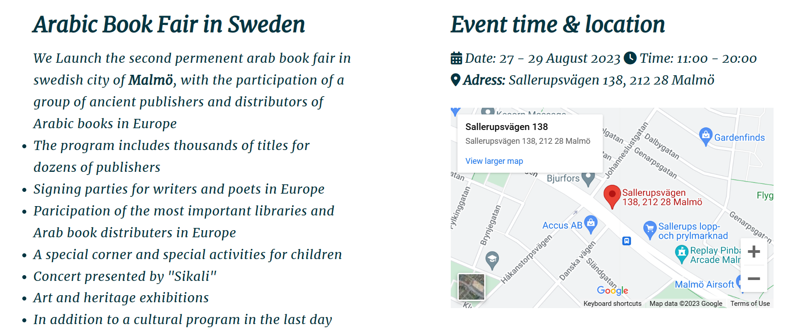
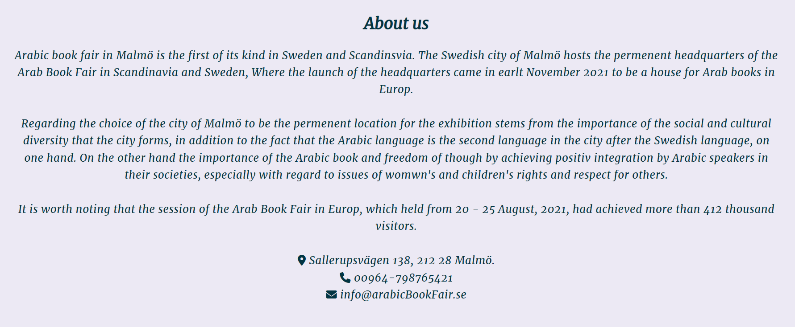
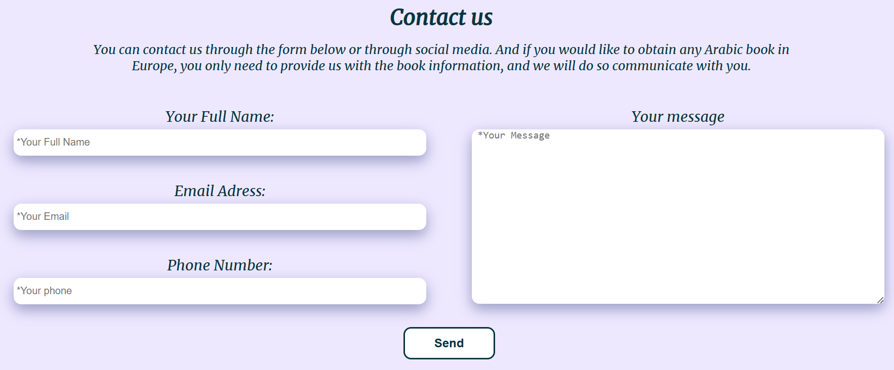
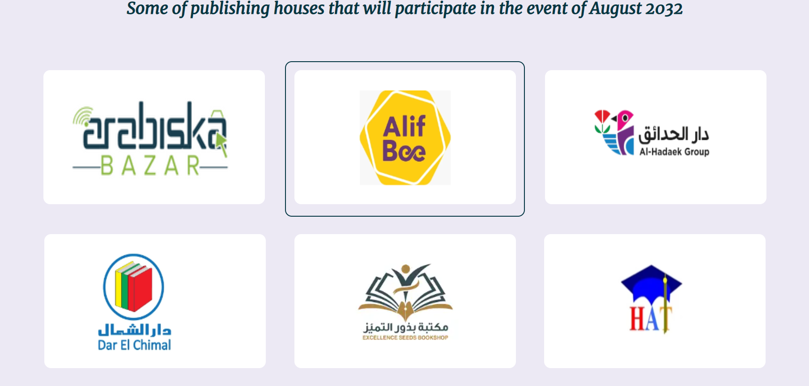

# **Arabic Book Fair**
Arabic book fair is an exhibition for Arab books in Sweden in Malmö city. The site targets Arabs in Sweden, where it will be useful to help in informing about the details of the annual exhibition that will be held in addition to help people to reserve books from arabs countries to be available in the exhibition. 

Welcome to the journey through <a href="https://alayousef.github.io/Portfolio-project1/" target="_blank" rel="noopener">Arab Book Fair</a>

---

## CONTENTS

* [**Design**](#design)
  * [**Colour Scheme**](#colour-scheme)
  * [**Typography**](#typography)
  

* [**Features**](<#features>)
    * [**Home page**](<#navigation-menu>)
         * [Navigation menu](<#navigation-menu>)
         * [Backround-cover-text](<#background-cover>)
         * [Fair-info section](<#fair-info>)
         * [Footer](<#footer>)
    * [**About us page**](<#about-us>)
        * About us 
      
            
    * [**Contact us page**](<#contact-us>)
       * Contact details
       
    
    * [**Publishers page**](<#publishers>)
        * Publishers houses

    * [**Form Confirmation**](<#form-confirmation>)
    * [**Future Features**](<#future-features>)

* [Technologies Used](#technologies-used)
  * [Languages Used](#languages-used)
  * [Frameworks, Libraries & Programs Used](#frameworks-libraries--programs-used)

* [Deployment & Local Development](#deployment--local-development)
  * [Deployment](#deployment)
  * [Local Development](#local-development)
    * [How to Fork](#how-to-fork)
    * [How to Clone](#how-to-clone)

* [Testing](#testing)

* [Credits](#credits)
  * [Code Used](#code-used)
  * [Content](#content)
  * [Media](#media)
  * [Acknowledgments](#acknowledgments)

---

## Design

### Colour Scheme

The colour scheme which chosen is one based on blue colour in different shades. Blue considered one of the calm and comfort colors, carries the meanings of avoidence of tension and ability to communicates with others. This is something that we want hopefully pass onto the user. In addition to, foreground information is never distracted the backgrounds.

### Typography
The fonts chosen were 'merriweather' with weight 400 Italic style for the headings and the body text.

'Merriweather' was chosen to give the user a comfortable feeling while reading. It's easy, clear and understandable. This font is imported from [Google Fonts](https://fonts.google.com/specimen/Merriweather?query=Merriweather)
[Back to top](<#contents>)

---

# Features
Arab Book Fair site is set up to be simple, clear and easy to use. It contains many features that the user probably need such as a navigation bar, contact form and most importantly, the information that user is looking for will be found once he opens the site. The goal in general is to let the user feel comfortable and lucidity that what he want to know is exist in the site, clear, understandable and can obtain easily.

## Existing Features  
  * ### Navigation Menu

    * Sited at the top of all the pages in the site at the right side, it is contains links to all the pages of the site to enable ease of movement from one page to another in addition to, the user can know easily what page he is currently on.
    * The logo also is clickable and link to the home page.

[Back to top](<#contents>)

  * ### Backround-cover-text

      * Located on the background on the home page on right side. It was intended to allow user get a quick look about the fair details.

[Back to top](<#contents>)

  * ### Fair-info section
    * Fair info section lets the user know all details about the exhibition. Including the time, date and location, in addition to inforamtion about the activities that will be in the exhibition.

    * An intended map will help the user to get the exact  location for the exhibition 

[Back to top](<#contents>)

* ### Footer
    
    * Footer section include links to the relevent social media sites for Arab Book Fair in Sweden. And the links to social media platforms will open in a new tab to allow easy of navigation for the user.
    * The social media will help the user in research into Sweden Arab Book Fair pages in social media.
    

[Back to top](<#contents>)

* ### About us page

    * About us page give the user an overview about what is the arab book fair in Sweden, responsible parts and the reason for choosing the city in which it will be held.

[Back to top](<#contents>)

* ### Contact us page

    * This page will allow the user to get contact to Arab book fair to inquire about something related to the exhibition or book a specific books to be available in the exhibition.
    * The user will be asked to submit their full name, phone number, email address and the message he want.
    * The user should fill out the form completly to be sent, otherwise he will be asked to enter the missing information.
    

* ### Publishers page
    * The publishers page will provide the user with supporting images withe the most imporatnt publishing houses that will participate in the exhibition.
    * It provides a direct link that opens in a new tab back to see the books for each publishing houses that will be available in the exhibition.

