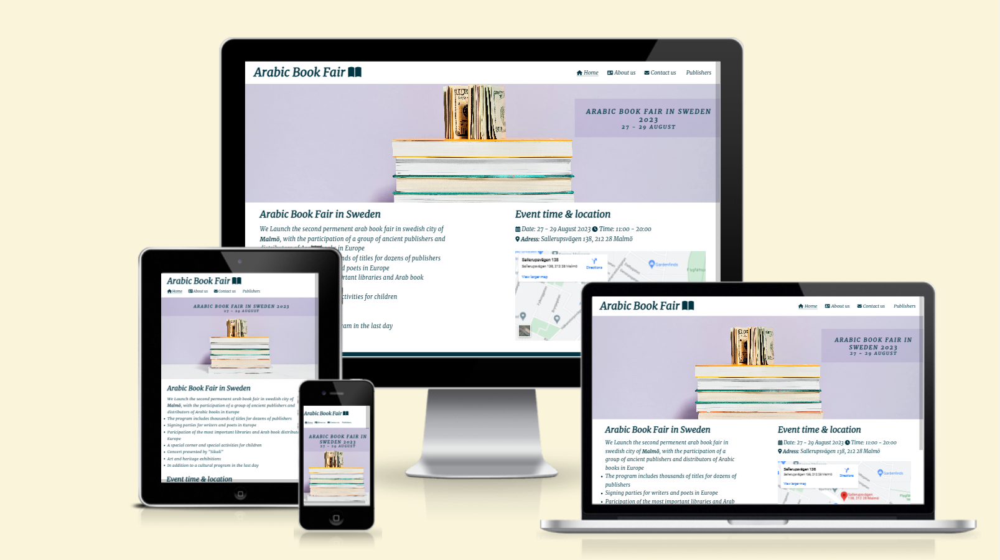
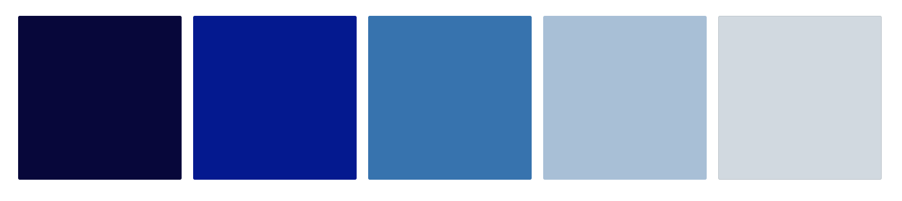

# **Arabic Book Fair**
Arabic book fair is an exhibition for Arab books in Sweden in Malmö city. The site targets Arabs in Sweden, where it will be useful to help in informing about the details of the annual exhibition that will be held in addition to help people to reserve books from arabs countries to be available in the exhibition. 

Welcome to the journey through <a href="https://alayousef.github.io/Portfolio-project1/" target="_blank" rel="noopener">Arab Book Fair</a>

---

## CONTENTS

* [Design](#design)
  * [Colour Scheme](#colour-scheme)
  * [Typography](#typography)
  * [Imagery](#imagery)
  * [Wireframes](#wireframes)

* [Features](#features)
  * [General Features on Each Page](#general-features-on-each-page)
  * [Future Implementations](#future-implementations)
  * [Accessibility](#accessibility)

* [Technologies Used](#technologies-used)
  * [Languages Used](#languages-used)
  * [Frameworks, Libraries & Programs Used](#frameworks-libraries--programs-used)

* [Deployment & Local Development](#deployment--local-development)
  * [Deployment](#deployment)
  * [Local Development](#local-development)
    * [How to Fork](#how-to-fork)
    * [How to Clone](#how-to-clone)

* [Testing](#testing)

* [Credits](#credits)
  * [Code Used](#code-used)
  * [Content](#content)
  * [Media](#media)
  * [Acknowledgments](#acknowledgments)

---

## Design

### Colour Scheme

The colour scheme which chosen is one based on blue colour in different shades. Blue considered one of the calm and comfort colors, carries the meanings of avoidence of tension and   ability to communicates with others. This is something that we want hopefully pass onto the user.

### Typography
The fonts chosen were 'merriweather' for the headings and the body text.

'Merriweather' was chosen to give the user a comfortable feeling while reading. It's easy, clear and understandable. This font is imported from [Google Fonts](https://fonts.google.com/specimen/Merriweather?query=Merriweather)

### Imagery

Use this section to explain what sort of imagery you plan to use through your site.

### Wireframes

Add the images or links for your wireframes here.

There are lots of different options to create your wireframes - Code Institute students can access [Balsamiq](https://balsamiq.com/) as part of the course.

Some other options include [Figma](https://www.figma.com/), [AdobeXD](https://www.adobe.com/products/xd.html), [Sketch](https://www.sketch.com/?utm_source=google&utm_medium=cpc&adgroup=uxui&device=c&matchtype=e&utm_campaign=ADDICTMOBILE_SKETCH_GAD_DG_UK_T1_ALWAYS-ON_S_TRF_PROS_BRAND&utm_term=sketch&utm_source=google&utm_medium=cpc&utm_content=TOF_BRND__generic&hsa_acc=8710913982&hsa_cam=16831089317&hsa_grp=134620695759&hsa_ad=592060065319&hsa_src=g&hsa_tgt=kwd-14921750&hsa_kw=sketch&hsa_mt=e&hsa_net=adwords&hsa_ver=3&gclid=Cj0KCQjwr4eYBhDrARIsANPywCjRIFn93DMezYnsyE5Fic_8l8kynJtut0GYMU01TiohHjwziFtlH0gaAhteEALw_wcB) and [Mockup](https://apps.apple.com/us/app/mockup-sketch-ui-ux/id1527554407) to name just a few! Or you can even go old school and get those wireframes completed using pen and paper. Just snap an image of the completed wireframes to add the images to the README.
