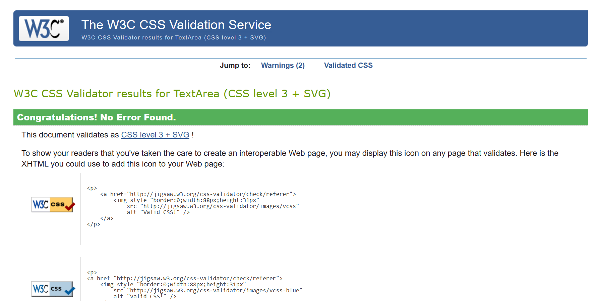
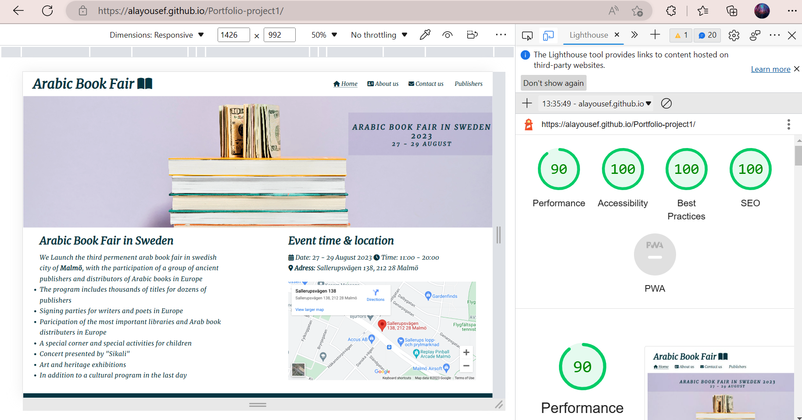
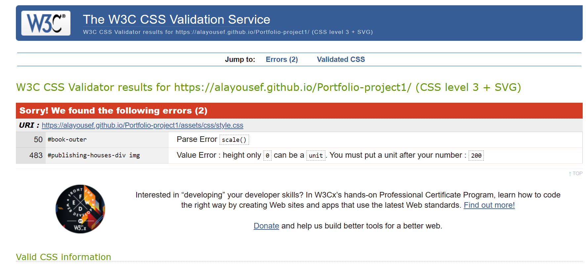

# Testing
## Code Validation
The Arabic Book Fair site has be tested. All pages has been run through the [W3C html Validator](https://validator.w3.org/) and the [W3C CSS Validator](https://jigsaw.w3.org/css-validator/). One error were found on the home page. After fix and retest, no errors were found. 

The HTML validator results for the whole site are below:

The CSS validator results are below:

## Responsiveness Test

* The responsive design were tested manually with [Google Chrome DevTools](https://developer.chrome.com/docs/devtools/). And on [amiresponsive](https://ui.dev/amiresponsive).

## Browser Compatibility

Arabic Book Fair site was tested on Google Chrome, Microsoft Edge, Safari Firefox. Appearance, functionality and responsiveness were consistent throughout for a range of device sizes and browsers.
Except background animation for about-us page on Firefox, animatoin appears image after image instead of disappearing slowly to show the next image as expected.  

## Light House

Arabic Book Fair was also tested using [Google Lighthouse](https://developers.google.com/web/tools/lighthouse) that provided by chrome Developer Tool to test the site for the following:
* Performance - How the page performs while loading.
* Accessibility - Is the site acccessible for users.
* Best Practices - Site conforms to industry best practices.
* SEO - These ensure that the page is following basic search engine optimization advice.

## Known Bugs
* ### Resolved

    * During validation two bugs shown during the validation stage of css page,which is :

    

The errors fixed by adding 'px' unit to the height, and add a scale value, but it was deleted because it is not used. 

* ### Unresolved
    * The background animation in about-us page does not work as expected on Firefox page.
